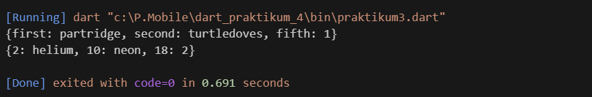

                        LAPORAN PRAKTIKUM
Praktikum 1: Eksperimen Tipe Data List 
  

Praktikum 2: Eksperimen Tipe Data Set  

Praktikum 3: Eksperimen Tipe Data Maps  

Praktikum 4: Eksperimen Tipe Data List: Spread dan Control-flow Operators  

Praktikum 5: Eksperimen Tipe Data Records  

Tugas Praktikum  
1. Jelaskan yang dimaksud Functions dalam bahasa Dart!   
JAWAB: Fungsi dalam bahasa Dart adalah unit kode yang dapat digunakan kembali untuk melakukan tugas tertentu. Fungsi membantu memecah program yang kompleks menjadi bagian-bagian yang lebih kecil dan mudah dikelola. Sebuah fungsi di Dart memiliki nama, tipe pengembalian, dan tubuh yang berisi kode yang akan dieksekusi.
2. Jelaskan jenis-jenis parameter di Functions beserta contoh sintaksnya!  
JAWAB:   
Parameter Posisi: Parameter ini wajib dan harus diberikan dalam urutan yang benar.   
Parameter Bernama: Parameter ini opsional dan dapat diberikan dalam urutan apa pun. Mereka ditulis dalam kurung kurawal.   
Parameter Posisi Opsional: Parameter ini opsional dan ditulis dalam tanda kurung siku.  
Contoh: 
3. Jelaskan maksud Functions sebagai first-class objects beserta contoh sintaknya!   
JAWAB: Dalam Dart, fungsi adalah objek kelas satu, artinya mereka dapat ditetapkan ke variabel, diteruskan sebagai argumen ke fungsi lain, dan dikembalikan sebagai nilai dari fungsi lain.   
Contoh: pada kode praktikum5.dart
4. Apa itu Anonymous Functions? Jelaskan dan berikan contohnya! 
JAWAB: Functions Anonymous, dikenal sebagai lambda atau fungsi inline, adalah fungsi tanpa nama. Mereka sering digunakan sebagai argumen untuk fungsi lain. Contoh: pada kode praktikum1.1 dart
5. Jelaskan perbedaan Lexical scope dan Lexical closures! Berikan contohnya!   
JAWAB:    
Lexical Scope: Mengacu pada wilayah dalam kode di mana sebuah variabel didefinisikan dan dapat diakses.    
Contoh: pada kode praktikum5.dart
Lexical Closures: Fungsi yang menangkap variabel dari lingkup sekitarnya.  
Contoh: pada kode praktikum3.dart dan kode praktikum4.dart
6. Jelaskan dengan contoh cara membuat return multiple value di Functions!  
JAWAB: Di Dart, Anda dapat mengembalikan beberapa nilai menggunakan struktur mirip tuple atau kelas.   
Contoh: 
